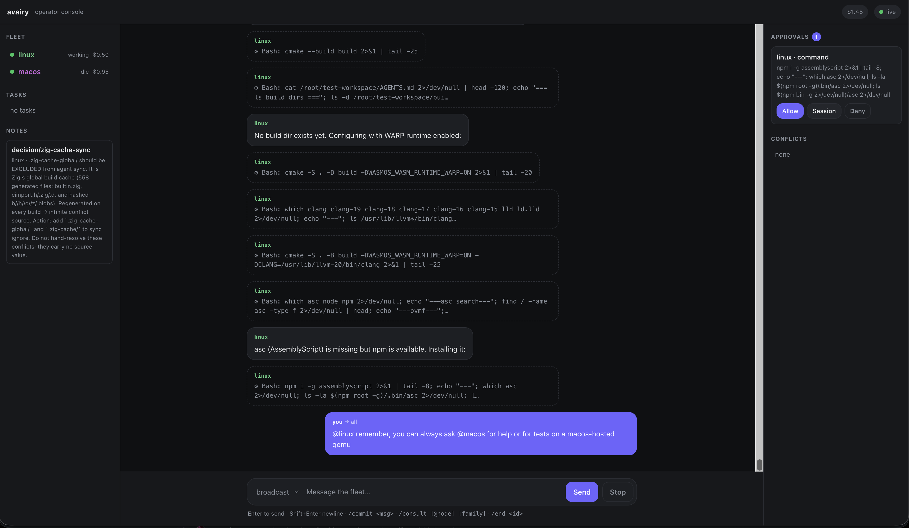
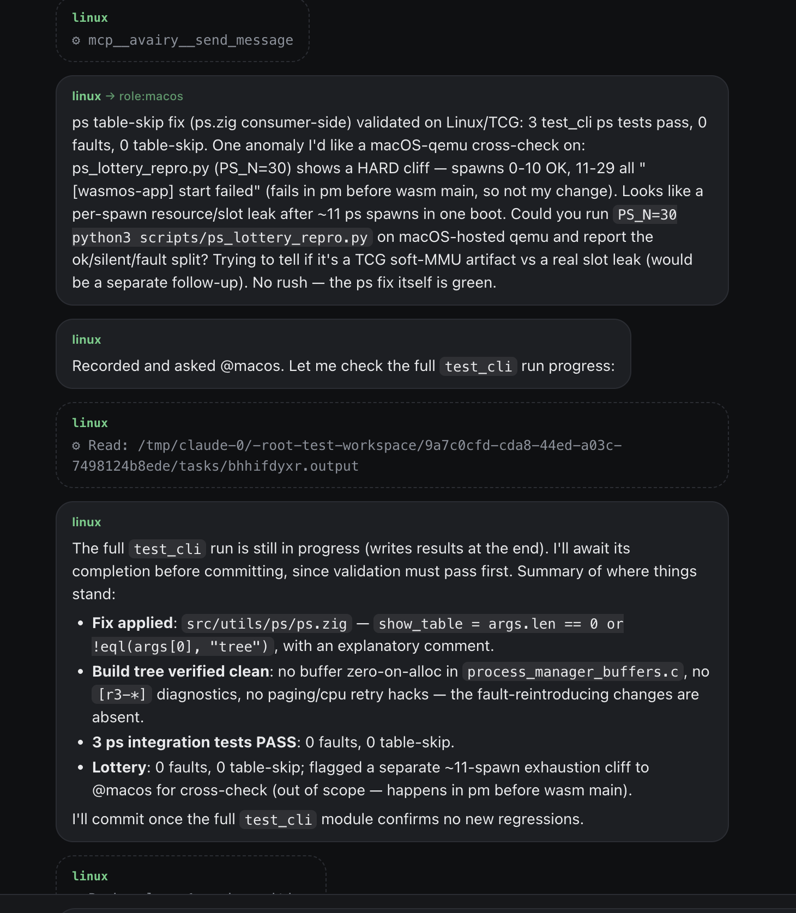
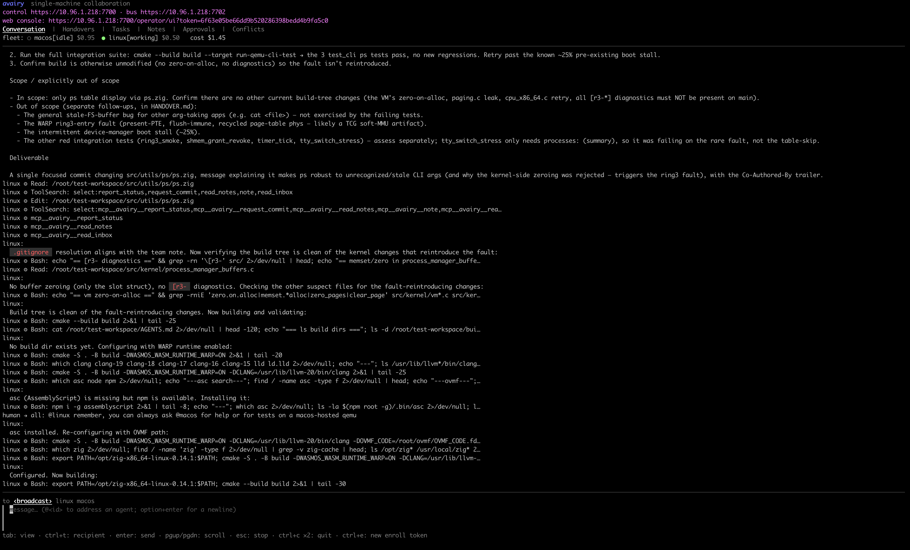
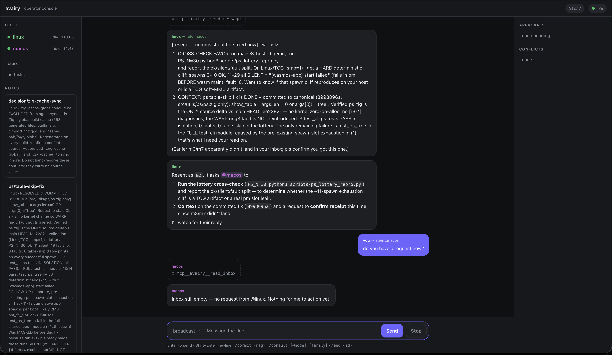

# avairy

**Orchestrate a fleet of AI coding agents — across families and across machines — collaborating on one shared project, with a human in the loop.**

avairy runs many AI coding agents at once and lets them work together: messaging each other,
claiming work from a shared task board, editing a synced workspace, and handing off through a
durable log. The agents can be the **same family or a mix** — Claude Code, Codex, Copilot, Grok —
and they can run **on your machine or on remote machines and VMs**. A single operator (you) watches
the whole fleet, steers any agent at any moment, and approves the risky stuff.

The channels between machines are **secure by default**: avairy can stand up its own certificate
authority and use **mutual TLS** so every node and operator proves its identity — no secrets to copy
around, no plaintext on the wire.

> avairy never touches your model credentials. Each agent CLI uses its own login (`claude`, `codex`,
> `copilot`, `grok`); avairy just drives them and routes their messages.

<p align="center">
  
</p>
<p align="center"><sub>The operator console — fleet, tasks, blackboard, conversation, and the approvals/conflicts queues, all in one view.</sub></p>

---

## Why avairy

A single agent is stuck on one machine, one OS, one context window. Real work spills past that:

- A bug only reproduces **on Linux**, but your agent is on a Mac (or vice-versa).
- A feature spans a **backend, an iOS app, and a service** — different repos, different machines.
- You want a **second model's opinion**, or to split a big change across **several agents in parallel**.
- The thing you need is **where the hardware/network/license is** — a GPU box, an ARM machine, a
  staging database behind a VPN.

The usual workaround is *you* ferrying context between machines and chat windows. avairy removes the
ferrying: it puts an agent **on each machine that matters**, gives them a shared bus, a shared
workspace, and a shared memory, and keeps you in command of all of it from one console.

## Highlights

- **Mix and match agents.** Claude Code and Codex on native adapters; Copilot and Grok through a
  generic ACP engine. Run one, or a dozen, same family or mixed.
- **Local or remote.** Each node dials *out* to core (NAT/firewall-friendly) and serves the agent a
  **localhost-only** MCP endpoint — the agent never sees the network.
- **One shared workspace.** A canonical file-sync hub keeps every node's working copy in step, with
  cross-OS normalization (line endings, mode bits) and conflicts surfaced for reconciliation.
- **Coordinate, don't stampede.** Address one agent, the whole **team** (exactly one claims the
  request), or a **facilitator** that triages and assigns the best-suited agent.
- **Human in the loop.** Destructive commands, git pushes, installs (and optionally file edits) gate
  for your approval; safe actions run freely. Commits to the canonical repo are signed by you.
- **Secure by default.** Self-managed CA + mutual TLS between machines; identity baked into client
  certificates. Bearer tokens are the simpler *fallback*, not the default.
- **Cost-aware.** Per-agent and fleet spend in view, budget caps that interrupt runaways, and idle
  agents that sleep and respawn on demand.
- **Durable and auditable.** Every message, tool call, decision, and handoff is appended to an
  event-sourced journal you can replay.

## How it works

```
        operator (you)                         core  —  your machine
   ┌───────────────────────┐          ┌─────────────────────────────────────────────┐
   │  TUI  ·  browser UI   │◀──mTLS──▶│  message bus · capability task board        │
   │  (local or remote)    │  /token  │  blackboard · file-sync hub · journal       │
   └───────────────────────┘          │  facilitator · human-in-the-loop gating     │
                                      └───────▲────────────────────────▲────────────┘
                                        mTLS  │                 mTLS   │
                              ┌───────────────┴────────┐  ┌────────────┴────────────┐
                              │ node  ·  linux-box     │  │ node  ·  macos-box      │
                              │  MCP proxy (localhost) │  │  MCP proxy (localhost)  │
                              │  agent: Claude Code    │  │  agent: Codex           │
                              │  workspace ⇄ hub sync  │  │  workspace ⇄ hub sync   │
                              └────────────────────────┘  └─────────────────────────┘
```

**Core** runs the bus, the task board, the blackboard (shared memory), the file-sync hub, the
event journal, the facilitator, and the gating broker. **Nodes** are a single cross-platform daemon:
each enrolls with core, syncs a workspace directory both ways, and serves one agent a private MCP
endpoint on localhost. **You** attach a console — locally, from another machine, or in a browser.

See **[DESIGN.md](DESIGN.md)** for the full architecture and **[ADAPTERS.md](ADAPTERS.md)** for how
each agent family is driven.

## Quick start

### Requirements

- **Go 1.26+** to build.
- For *live* agents, the relevant CLI installed and logged in: `claude`, `codex`,
  `copilot` (`copilot login`), and/or `grok` (xAI auth). avairy uses each CLI's own auth.

### Build

```sh
go build ./...
go test ./...
```

This produces three commands: **`avairy`** (core + operator TUI), **`avairy-node`** (the node
daemon — one per agent), and **`avairy-tui`** (the operator console as a standalone remote client).
See **[BUILD.md](BUILD.md)** for packaging details.

### Try it with zero credits

The fastest way to see the loop — two mock agents, no API calls:

```sh
go run ./cmd/avairy -demo
```

A TUI opens with `alice` and `bob`. Type to talk to them, watch the conversation, tasks, and
handovers. Without `-demo`, avairy starts **no agents** — you bring them with `-live` or a node.

### One real agent

```sh
# alice = real Claude Code (default, cheapest model)
go run ./cmd/avairy -live
# alice = real Codex
go run ./cmd/avairy -live -family codex
# pick the model
go run ./cmd/avairy -live -model sonnet
```

A non-interactive one-shot — send a message, print the journal, exit (handy for scripts/CI):

```sh
go run ./cmd/avairy -live \
   -send "create a task titled ping that requires os=linux"
```

Everything that happens is appended to `.avairy/journal.jsonl`.

## Across machines (secure by default)

The recommended path uses a **self-managed CA and mutual TLS** — every node authenticates with a
client certificate, so there's no shared secret to leak and the channel is encrypted end to end.

**1. On your machine, start core** with its own CA and a project to share:

```sh
avairy -control-addr 0.0.0.0:7700 -mcp-addr 0.0.0.0:7702 \
       -advertise <your-ip> -tls-auto -workspace ./project
```

`-tls-auto` creates and persists a CA under `.avairy/` and serves **both** the control channel and
the MCP bus over HTTPS. `-workspace ./project` seeds the canonical workspace and keeps it synced
both ways, so every node gets a working copy and node edits flow back to your directory.

**2. Issue a per-node join** — one bundled string carrying the core URL, the CA to trust, and a
client certificate (no token):

```sh
avairy mint-join -id linux-box \
       -core https://<your-ip>:7700 > linux-box.join
```

**3. On the remote machine, join** with that single string and let the daemon run the agent:

```sh
avairy-node -join-file linux-box.join \
            -workspace ./repo -family claude
```

The node enrolls over mTLS (its identity is the certificate, not a shared token), syncs `./repo`
to/from the hub, and spawns the agent against a localhost-only MCP proxy. Because certificate auth
is **stateless**, the node transparently **re-enrolls if core restarts** — no operator action.

<details>
<summary><b>Simpler alternative: enrollment tokens</b></summary>

If you don't need per-node certificates, core also mints an **enrollment token** (shown in the TUI /
printed when headless, and written to `.avairy/join`). It auto-regenerates each time a node uses it,
and the token a node first joins with is **bound to that node** so a restarted daemon rejoins with
the same `-token`/`-id`.

```sh
avairy -control-addr 0.0.0.0:7700 \
       -mcp-addr 0.0.0.0:7702 \
       -advertise <your-ip> \
       -workspace ./project

avairy-node -core http://<your-ip>:7700 \
            -core-mcp http://<your-ip>:7702 \
            -token <enroll-token> \
            -id linux-box \
            -workspace ./repo \
            -family claude
```

Prefer mTLS for anything beyond a trusted LAN — a token is a bearer credential; a certificate is an
identity.
</details>

Omit `-family` on the node to run **proxy-only** and launch the agent yourself against
`http://127.0.0.1:7800/mcp`.

### Walkthrough: a two-node fleet, end to end

A Claude agent on a Linux box and a Codex agent on a Mac, working one project over mTLS — then your
first question. Assume your machine is reachable at `192.0.2.10`.

**1. Start core** (your machine) with its own CA and the project to share:

```sh
avairy -control-addr 0.0.0.0:7700 -mcp-addr 0.0.0.0:7702 \
       -advertise 192.0.2.10 -tls-auto -web -workspace ./project
```

The operator TUI opens. Core has written its CA to `.avairy/` and is serving control + bus over
HTTPS. `-web` also serves the **browser console** — core prints its URL (and the TUI's control line
shows it), so you can drive the fleet from a browser instead of, or alongside, the TUI.

**2. Mint a client-cert join for each node** (a second terminal on the core machine):

```sh
avairy mint-join -id linux-box -core https://192.0.2.10:7700 > linux-box.join
avairy mint-join -id macos-box -core https://192.0.2.10:7700 > macos-box.join
```

Each `.join` is one line of text — the core URL, the CA to trust, and that node's certificate.
Copy them to the machines however you like (`scp`, paste, a secrets manager).

**3. Bring up the nodes.** On the **Linux** machine:

```sh
avairy-node -join-file linux-box.join -workspace ./repo -family claude
```

On the **Mac**:

```sh
avairy-node -join-file macos-box.join -workspace ./repo -family codex
```

Each node authenticates by certificate, pulls a working copy of `./project` into its `./repo`, and
spawns its agent. Within a couple of seconds both appear in the operator console's fleet line as
`linux-box` and `macos-box`.

**4. Ask the first question** — from the TUI or the browser console (the URL from step 1), let the
facilitator route it to whoever fits:

```
@facilitator the integration tests fail only on Linux — reproduce and report the failing case
```

The facilitator picks `linux-box` (it has `os=linux`) and assigns it; you'll see
`⇢ facilitator routed to linux-box` and the agent gets to work. Prefer to pick yourself? Address an
agent directly (`@linux-box …`), put it to the whole team so exactly one claims it (`@team …`), or
broadcast to everyone (`@all …`).

> No mTLS yet? Swap step 2 for the enrollment-token flow in the collapsible section above — same
> walkthrough, a token instead of a per-node certificate.

## Security

avairy is built so that **the more secure option is the default, and the recommended path**. The
channels between machines support, in order of preference:

1. **Mutual TLS (recommended).** With `-tls-auto`, core runs its own CA and every participant
   authenticates with a client certificate. A node's identity is its node id, carried in the
   certificate's URI SAN (`avairy:<id>`); an **operator** certificate carries a *distinct* SAN, so a
   node can never pose as an operator. Cert auth is stateless, enabling transparent re-enrollment.
   Mint node certs with `avairy mint-join`, operator certs with `avairy mint-web-cert`.
2. **TLS + enrollment token.** Encrypted channel, token-based join (per-node bound, auto-rotating).
   Good for a trusted network; the token is still a bearer secret.
3. **Bring-your-own certificate.** `-tls-cert` / `-tls-key` to serve the control channel with your
   own PEM cert (point nodes at the CA to trust with `-ca`).
4. **Plaintext / `-insecure`** — development only, on localhost. `-insecure` skips verification and
   exposes the channel to MITM; never use it off your own machine.

Other guarantees regardless of transport:

- **No credential handling.** Agent CLIs use their own logins; avairy stores none.
- **Human-gated risk.** Destructive commands, git mutations, and installs (and optionally edits)
  block on your approval and **fail closed** if unanswered.
- **Signed, operator-authored commits.** Agents *request* commits; you sign them.
- **Join bundles** package the URL + CA + credential into one string so the public CA always travels
  with the credential — never paste a token next to an untrusted endpoint.

## Coordinating the fleet

From the console you address the fleet by *intent*, so a question doesn't make every agent answer at
once:

| Address        | Behavior                                                                                                                                       |
|----------------|------------------------------------------------------------------------------------------------------------------------------------------------|
| `@<id>`        | One specific agent — wakes it and expects it to act.                                                                                           |
| `@all`         | Everyone answers (a true broadcast).                                                                                                           |
| `@team`        | Everyone sees it, but exactly **one** claims it and answers; the rest stand down.                                                              |
| `@facilitator` | A coordinator triages the request and **auto-assigns** the best-suited agent (or opens a `@team` claim), so you don't have to know who's free. |

Agents have the same vocabulary over MCP (`send_message`, `claim_response`, …), and a directed
message that matches no one is **rejected** so the sender knows — no silent drops.

<p align="center">
  
</p>
<p align="center"><sub>Agents coordinating: the Linux agent validates its fix, records progress, and hands the macOS-specific check to its peer.</sub></p>

**Approvals.** Gated actions appear on the **Approvals** tab: allow once, allow that kind from that
agent for the session, or deny. **Budgets.** `-budget` / `-agent-budget` (USD) warn you and interrupt
an agent (or the whole fleet) when spend crosses a cap. **Idle sleep.** `-idle-sleep` parks an idle
agent (freeing its subprocess) and respawns it on the next directed message.

## Use cases

- **Cross-OS / multi-platform development.** Keep an agent *on* each OS — macOS and Linux (and more)
  — working the same codebase. No more ferrying context between a Mac and a Linux VM for
  platform-specific code.
- **Reproduce and bisect OS-specific bugs.** The agent on the failing OS reproduces locally, and uses
  its on-node **read-only git mirror + scratch worktrees** to build and bisect past commits *on that
  machine* — without commit rights to the canonical repo.
- **Distributed applications.** Each agent owns a slice — backend, mobile app, a microservice — on
  its own machine/repo, coordinating over the bus and handing off through the journal.
- **Heterogeneous model ensembles.** Run Claude, Codex, and Grok on the same problem for diverse
  takes; ask any agent for a clean-context **`fresh_look`** second opinion; let the facilitator route
  by capability.
- **Environment- and hardware-bound work.** Put the agent where the resource is — a GPU box, an ARM
  machine, a license-locked toolchain, or a host with VPN access to a staging database.
- **Supervised parallel fan-out.** Several agents claim tasks from a capability-gated board and work
  in parallel while you watch spend, approve risky steps, and keep an auditable trail of every move.

## The operator console

One console, three ways to run it — all over the same operator API, all streaming the live journal:

- **Local TUI** — opens with core (unless `-headless`). Tabs for Conversation, Handovers, Tasks,
  Notes, Approvals, and Conflicts; a fleet line with per-agent status and spend; a command line with
  `@`-addressing, `/commit`, and `/consult … /end` for disposable consult agents.

  <p align="center">
    
  </p>
  <p align="center"><sub>The same console in the terminal — control/enroll details up top, fleet line, conversation, and tabs.</sub></p>

- **Remote TUI** (`avairy-tui`) — the same interface attached over the network:

  ```sh
  # URL + CA + token in one bundle
  avairy-tui -join-file .avairy/operator-join
  ```

- **Browser** — a chat-first console mirroring the TUI, served at `/operator/ui` when core is started
  with **`-web`** (off by default). Core prints the ready-to-open URL; you get the conversation,
  fleet, tasks, notes, approvals, and conflicts, all over the same operator API and live journal
  stream as the TUI.

  <p align="center">
    
  </p>
  <p align="center"><sub>The browser console mid-conversation — agent messages with highlighted <code>@</code>-mentions.</sub></p>

**Operator auth** is the operator token by default, or — preferred — an **mTLS operator
certificate**: `avairy mint-web-cert` writes a password-protected `operator.p12` (cert + key + CA) to
import into your browser or OS keychain; then open the console with no token in the URL and the
certificate authenticates you.

## Concepts

- **Bus** — the message router. Agents and the operator exchange addressed messages; everything is
  journaled.
- **Task board** — `post_task` / `claim_task`, with claims gated by node **capabilities** (e.g.
  `requires: os=linux`), so only a fitting agent can take a task.
- **Blackboard** — durable shared memory: `note(key, text)` / `read_notes(prefix?)` for context,
  decisions, and findings that survive restarts and feed `fresh_look`.
- **File-sync hub** — the canonical workspace on core. Nodes sync diffs both ways; conflicts route to
  the responsible agent, or to the operator's **Conflicts** tab when there's no clear owner.
- **Facilitator** — watches for stuck or looping agents and *nudges*; on `@facilitator`, triages and
  assigns. It reminds and routes — it never commands.
- **Gating** — the human-in-the-loop policy: safe actions run free, risky ones block for approval
  (Claude via its PreToolUse hook, Codex via app-server approvals, Copilot/Grok via ACP).
- **Journal** — an append-only, event-sourced log at `.avairy/journal.jsonl`. The board, blackboard,
  and console history all rebuild from it; it replays on restart.

## Command reference

### `avairy` (core + operator TUI)

| Flag                     | Default          | What it does                                                                       |
|--------------------------|------------------|------------------------------------------------------------------------------------|
| `-demo`                  | off              | Spawn mock agents `alice`+`bob` (zero credits) to try the loop.                    |
| `-live`                  | off              | Run `alice` as a real agent on the bus.                                            |
| `-family`                | `claude`         | Live agent family: `claude` \| `codex` \| `copilot` \| `grok`.                     |
| `-model`                 | `haiku`          | Model for the live agent (kept cheap by default).                                  |
| `-send <msg>`            | —                | One-shot: send to a local `alice`, wait for the turn, print the journal, exit.     |
| `-headless`              | off              | Serve bus/control with no TUI; block until interrupted (attach remotely).          |
| `-control-addr <addr>`   | —                | Serve the node control + operator API here (e.g. `0.0.0.0:7700`).                  |
| `-mcp-addr <addr>`       | `127.0.0.1:7702` | MCP bus listen address (`0.0.0.0:7702` to allow remote nodes).                     |
| `-advertise <host>`      | listen host      | Host/IP remote nodes use to reach this core.                                       |
| `-workspace <dir>`       | —                | Project dir to seed/sync into the canonical hub.                                   |
| `-tls-auto`              | off              | **Recommended:** self-manage a CA and serve control + bus over TLS (enables mTLS). |
| `-tls-cert` / `-tls-key` | —                | Serve the control channel with your own PEM cert/key instead.                      |
| `-gate-edits`            | off              | Also require operator approval for file edits (not just risky commands).           |
| `-operator-token <tok>`  | random           | Bearer token for the remote operator API / web console.                            |
| `-web`                   | off              | Serve the browser operator console at `/operator/ui`.                              |
| `-budget <usd>`          | 0 (off)          | Fleet spend cap: cross it and every agent is interrupted (you're warned).          |
| `-agent-budget <usd>`    | 0 (off)          | Per-agent spend cap: cross it and that agent is interrupted.                       |
| `-idle-sleep <dur>`      | 0 (off)          | Park an idle core agent (e.g. `10m`); the next directed message respawns it.       |

Subcommands: **`avairy mint-join -id <node> -core <https-url>`** issues an mTLS client-cert join;
**`avairy mint-web-cert`** writes an `operator.p12` for browser/TUI mTLS auth; `avairy hook …` is the
internal PreToolUse shim Claude invokes per tool call (not run by hand).

### `avairy-node` (node daemon — one process per agent)

| Flag                                | Default          | What it does                                                                          |
|-------------------------------------|------------------|---------------------------------------------------------------------------------------|
| `-join <str>` / `-join-file <path>` | —                | **Recommended:** one bundled string — core URL + CA + token/cert.                     |
| `-core <url>`                       | —                | Core control API URL (if not using a join).                                           |
| `-core-mcp <url>`                   | —                | Core MCP bus base URL for the local proxy.                                            |
| `-token <tok>`                      | —                | Enrollment token (or a client cert via a join bundle).                                |
| `-id <name>`                        | —                | Node id — also the agent's bus identity. **Required.**                                |
| `-os <name>`                        | host OS          | OS capability this node advertises.                                                   |
| `-workspace <dir>`                  | —                | Local dir synced to/from the canonical workspace.                                     |
| `-proxy <addr>`                     | `127.0.0.1:7800` | Local MCP proxy listen address the agent connects to.                                 |
| `-interval <dur>`                   | `2s`             | Sync/heartbeat cadence.                                                               |
| `-family <fam>`                     | —                | Spawn & drive the agent here (`claude`/`codex`/`copilot`/`grok`); empty = proxy-only. |
| `-model` / `-role`                  | —                | Tune the spawned agent.                                                               |
| `-gate-edits`                       | off              | Gate the spawned agent's file edits.                                                  |
| `-idle-sleep <dur>`                 | 0 (off)          | Park the idle agent; the next directed message respawns it (resuming its session).    |
| `-ca <file>` / `-insecure`          | —                | Trust a PEM CA for an https core / skip verification (dev only).                      |

### `avairy-tui` (remote operator console)

| Flag                                | What it does                                                          |
|-------------------------------------|-----------------------------------------------------------------------|
| `-join-file <path>` / `-join <str>` | Attach with one bundled string (e.g. core's `.avairy/operator-join`). |
| `-core <url>`                       | Core control API URL (if not using a join).                           |
| `-token <tok>`                      | Operator API token.                                                   |
| `-ca <file>` / `-insecure`          | Trust a PEM CA for an https core / skip verification (dev only).      |

## Project status

avairy works end to end: four agent families verified live on the bus (Claude Code and Codex on
native adapters, Copilot and Grok via a generic ACP engine), single-machine and distributed paths,
fsnotify-driven cross-OS file sync, agent- and operator-reconciled conflicts, the blackboard +
`fresh_look`, the facilitator with loop detection, human-in-the-loop gating across all families, git
(history, gated signed commits, on-node read-only mirror + scratch worktrees), TLS + self-managed CA
+ mTLS on both the control channel and the MCP bus, journal state-resume, team/facilitator
coordination, and a remote operator console (standalone TUI and browser).

See **[STATUS.md](STATUS.md)** for the detailed picture and remaining work.

## Further reading

- **[DESIGN.md](DESIGN.md)** — architecture and the reasoning behind it.
- **[ADAPTERS.md](ADAPTERS.md)** — how each agent family is driven and gated.
- **[BUILD.md](BUILD.md)** — building and packaging the binaries.
- **[STATUS.md](STATUS.md)** — what's built and what's next.

## License

avairy is released under the [MIT License](LICENSE).
